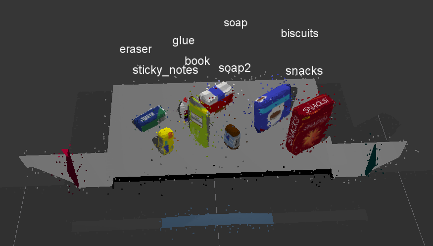
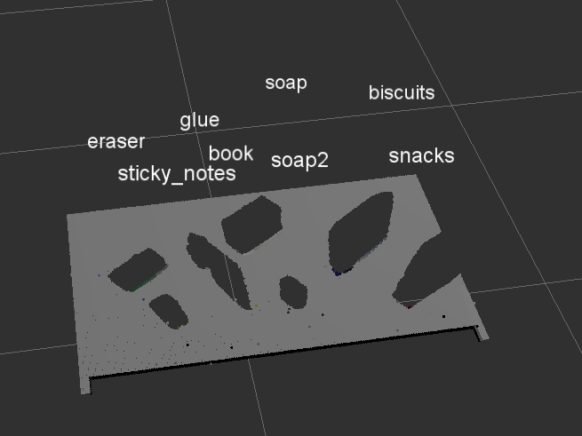
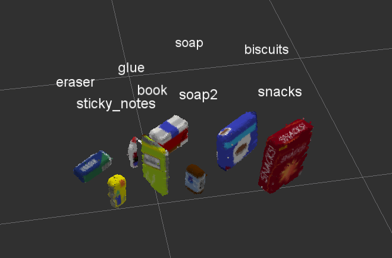
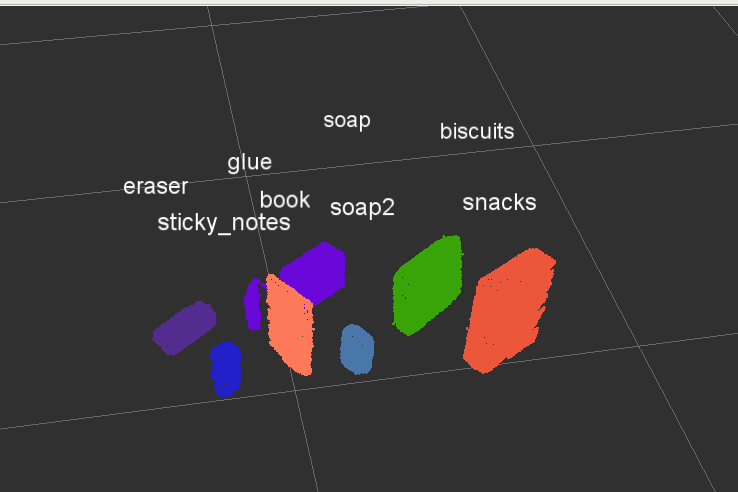
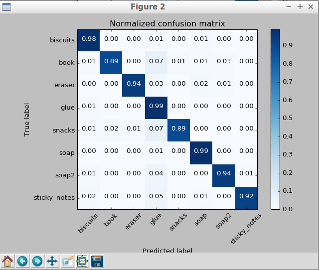
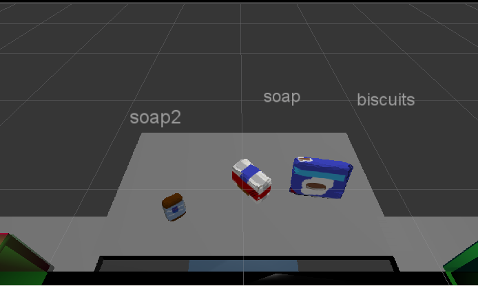
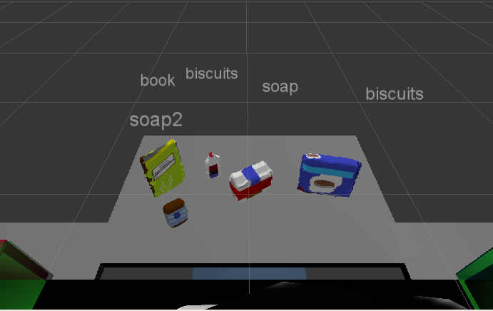
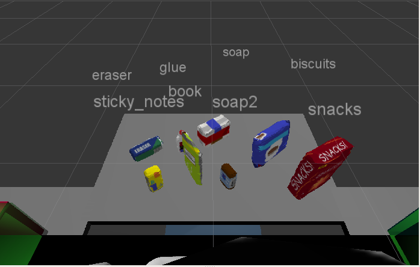
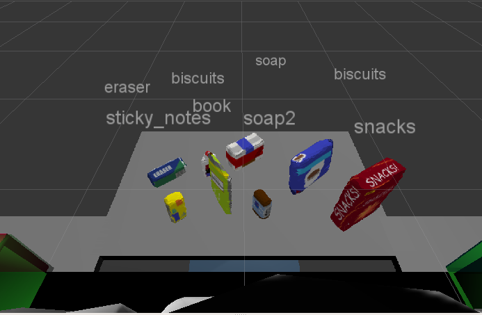

## Project: Perception Pick & Place

---


# Required Steps for a Passing Submission:
1. Extract features and train an SVM model on new objects (see `pick_list_*.yaml` in `/pr2_robot/config/` for the list of models you'll be trying to identify).
2. Write a ROS node and subscribe to `/pr2/world/points` topic. This topic contains noisy point cloud data that you must work with.
3. Use filtering and RANSAC plane fitting to isolate the objects of interest from the rest of the scene.
4. Apply Euclidean clustering to create separate clusters for individual items.
5. Perform object recognition on these objects and assign them labels (markers in RViz).
6. Calculate the centroid (average in x, y and z) of the set of points belonging to that each object.
7. Create ROS messages containing the details of each object (name, pick_pose, etc.) and write these messages out to `.yaml` files, one for each of the 3 scenarios (`test1-3.world` in `/pr2_robot/worlds/`).  [See the example `output.yaml` for details on what the output should look like.](https://github.com/udacity/RoboND-Perception-Project/blob/master/pr2_robot/config/output.yaml)  
8. Submit a link to your GitHub repo for the project or the Python code for your perception pipeline and your output `.yaml` files (3 `.yaml` files, one for each test world).  You must have correctly identified 100% of objects from `pick_list_1.yaml` for `test1.world`, 80% of items from `pick_list_2.yaml` for `test2.world` and 75% of items from `pick_list_3.yaml` in `test3.world`.
9. Congratulations!  Your Done!

# Extra Challenges: Complete the Pick & Place
7. To create a collision map, publish a point cloud to the `/pr2/3d_map/points` topic and make sure you change the `point_cloud_topic` to `/pr2/3d_map/points` in `sensors.yaml` in the `/pr2_robot/config/` directory. This topic is read by Moveit!, which uses this point cloud input to generate a collision map, allowing the robot to plan its trajectory.  Keep in mind that later when you go to pick up an object, you must first remove it from this point cloud so it is removed from the collision map!
8. Rotate the robot to generate collision map of table sides. This can be accomplished by publishing joint angle value(in radians) to `/pr2/world_joint_controller/command`
9. Rotate the robot back to its original state.
10. Create a ROS Client for the “pick_place_routine” rosservice.  In the required steps above, you already created the messages you need to use this service. Checkout the [PickPlace.srv](https://github.com/udacity/RoboND-Perception-Project/tree/master/pr2_robot/srv) file to find out what arguments you must pass to this service.
11. If everything was done correctly, when you pass the appropriate messages to the `pick_place_routine` service, the selected arm will perform pick and place operation and display trajectory in the RViz window
12. Place all the objects from your pick list in their respective dropoff box and you have completed the challenge!
13. Looking for a bigger challenge?  Load up the `challenge.world` scenario and see if you can get your perception pipeline working there!

## [Rubric](https://review.udacity.com/#!/rubrics/1067/view) Points
### Here I will consider the rubric points individually and describe how I addressed each point in my implementation.  

---
### Writeup / README

#### 1. Provide a Writeup / README that includes all the rubric points and how you addressed each one.  You can submit your writeup as markdown or pdf.  

You're reading it!

### Exercise 1, 2 and 3 pipeline implemented

All the code located here: [pick_place.py](pr2_robot/scripts/pick_place.py)

#### 1. Complete Exercise 1 steps. Pipeline for filtering and RANSAC plane fitting implemented.

1. Remove outliers to decrease noise. I wrote a function `outlier_filt` to do this job. I did nothing about  parameter `mean_k` with value 10, that worked fine. For the other parameter `dev_mul`, i started with 1 and then twiddled from 0.5, 0.1, 0.05 to 0.01, and finally i found 0.01 is good enough.
2. Vox Grid Downsampling with function `vox_filt`. For parameter `LEAF_SIZE`, i tested with 0.01 and 0.005, and found 0.005 is a little better than 0.01 for the perception job. I guess possibly a lower LEAF_SIZE means more density of points, and more features would be extracted from the filtered cloud.
3. PassThrough filtering out areas of no interest, with function `passthrough_filt`. I used 2 this filters along axis 'Z' and 'Y' respectively to filter out areas under the table and both left and right box.
4. Finally, RANSAC Plane Segmentation with function `seg_plane`. For the parameter `max_distance`, i tested 0.005 and 0.01, and found 0.005 would leave some dirty points and 0.01 is good enough.
5. Extract point cloud of table and objects respectively.(pick_place.py line #109-110)
```
    # Extract inliers and outliers
    cloud_table = cloud.extract( inliers, negative = False )
    cloud_objects = cloud.extract( inliers, negative = True )
```
Here are some screenshots for point clouds:
* Raw world point cloud with noise:  

* Table isolated:  

* Objects isolated:  



#### 2. Complete Exercise 2 steps: Pipeline including clustering for segmentation implemented.  

1. Now i got to isolate every object from `cloud_objects`, using Euclidean Cluster.
2. First, create a `white_cloud` of `cloud_objects` with color information removed.(pick_place.py line #113)
3. Call a function `euclidean_cluster` to do the extraction.(pick_place.py line #75)
4. For parameters, `min` and `max` are easy to tell. `tolerance` need be twiddled. I tested from 0.01(means LEAF_SIZE*2), to 0.05, then 0.05 worked fine, so i kept 0.05.
5. After i got the isolated object points by calling `euclidean_cluster`, i need to generate a new point cloud giving each object one different color.(pick_place.py line #118-133) That new cloud would be published into topic `/pcl_cluster`. (pick_place.py line #143)

Here is a screenshot for cluster point cloud:  


#### 3. Complete Exercise 3 Steps.  Features extracted and SVM trained.  Object recognition implemented.

1. Features extraction, the code located in sensor_stick/src/sensor_stick/features.py and sensor_stick/scripts/capture_features.py:
  * I was using ONLY color features. Of course i have tried color + normal features, but seemed normal features would not contribute to the perception.
  * In capture_features.py, i captured 200 samples for each model. I captured features for all of the 8 objects that covered all the 3 worlds.
  * For each sample, i generated ONLY color histogram features with bins=32.
2. SVM training, the code located in sensor_stick/scripts/train_svm.py:
  * For the kernel, i have tried linear and sigmoid, and the accuracy result turned out linear is a bit better.
  * The model was saved into `~/catkin_ws/`.
  * The accuracy is 0.94, here is the accuracy result:  
  
3. Object recognition(pick_place.py line #151-174):
  * Iterate all the indices extracted from `euclidean_cluster`.
  * Extract points from colorful `cloud_objects`, not `white_cloud`, because color features should be used for recognition. (line #157)
  * Compute color histogram features and then make a prediction with that trained model.(line #163)
  * Create a new DetectedObject and pushed into a list for publication.
  * Create markers with recognition label and publish it, then we can see the recognition result in RViz.(line #168-170)

### Pick and Place Setup

#### 1. For all three tabletop setups (`test*.world`), perform object recognition, then read in respective pick list (`pick_list_*.yaml`). Next construct the messages that would comprise a valid `PickPlace` request output them to `.yaml` format.

1. The code for yaml output located in pick_place.py line #183-215.
2. The 3 output yaml is: [output_1.yaml](output_1.yaml), [output_2.yaml](output_2.yaml), [output_3.yaml](output_3.yaml)  

Here are the screenshot of recognition in each world:
* World 1(All recognized correctly):  

* World 2(Failed to recognize glue):  

* World 3(Sometimes all correct, sometimes the glue is messed):  




### Discussions

1. In world 2, the glue cannot be recognized, and messed with biscuits. That's weired, because the color of glue and biscuits are not even a little similar. Maybe due to it's small size? I don't know yet.
2. In world 3, all the objects can be recognized correctly except glue. But this case, sometime the glue could be recognized, sometime are not. Still don't figure out why. Maybe relative to the generated noise?
3. In world 3, the glue is kind of hidden by another object, and in world 2 it is not. So when the glue is clear in the view, it will be recognized correctly(world 2).
